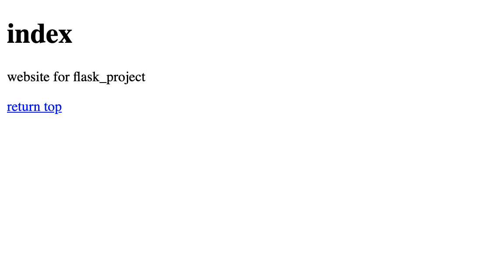

#  cookiecutter template for Flask project

[中文](./readme_zh.md)

## feature

- [x]  html5-boilerplate for template
- [x]  peewee for orm and migration achieved 
- [x]  docker & docker-compose integration
- [x]  per-commit & pytest & flake8 & black for workflow.
- [ ]    gitlab-ci for deployment on vps 

## usage

### install cookiecutter
    
pip install cookiecutter

### generate project

cookiecutter <https://github.com/Colaplusice/cookiecutter-flask-devops.git>
or

```bash
cd ~/.cookiecutters/
git clone  https://github.com/Colaplusice/cookiecutter-flask-devops.git
```
and you can `cookiecutter cookiecutter-flask-devops` everywhere 

## project options

- project_name          :project name to generate
- app_name              :app name
- create_api  yes/no    :whether to generate rest api
- vps_ssh               :your vps ssh address like ubuntu@111.231.1.1
- database_username     :database username,default is root
- database_password     :database password

## example 

```bash
cookiecutter cookiecutter-flask-devops

# cd the project you just created
cd flask_project

# create database on you localhost 
./boot.sh  createdb flask_project
./boot.sh  createdb flask_project_test

# unit test
pytest -s -x

# test run by docker-compose
docker-compose up 

```

open http://localhost  and you will see:
 